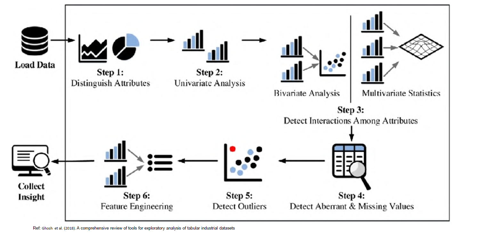
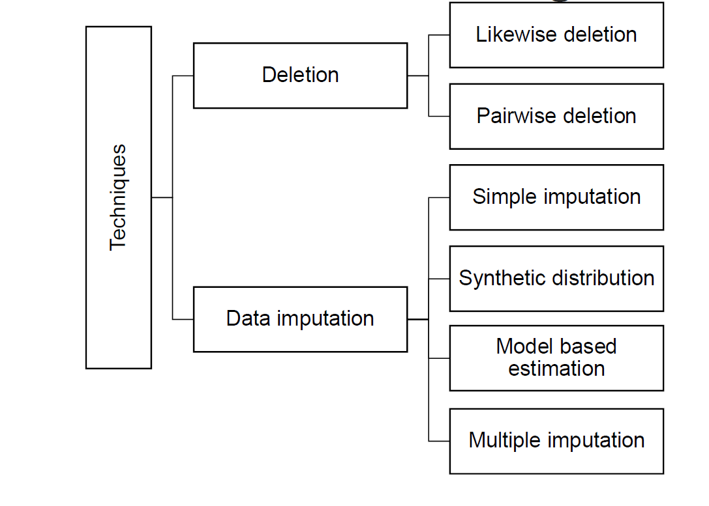
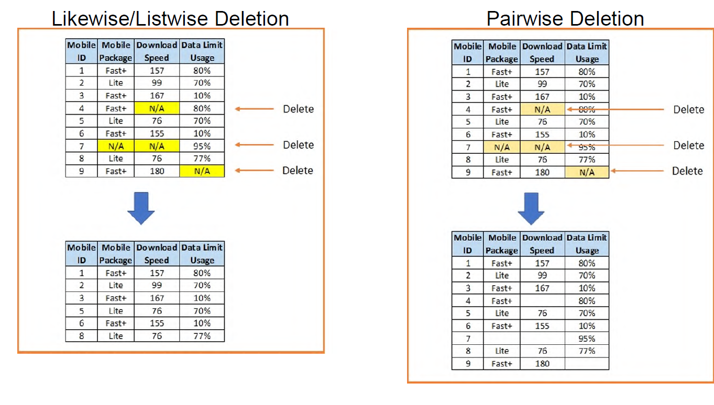
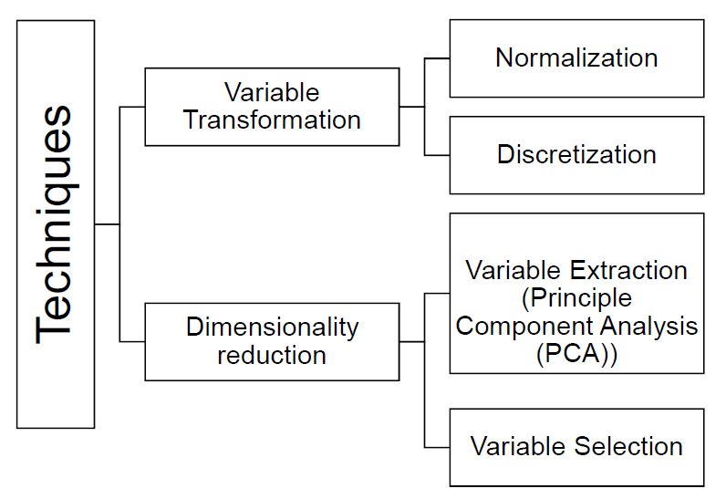

# EDA(探索性数据分析，Exploratory Data Analysis)

## EDA的基本概念：

-   最初由Tukey在1977年提出，用于通过简单的可视化方法(如箱线图、直方图等)来检查小型数据集
-   随着大数据时代(5V特征)的到来，传统EDA方法需要与现代分析工具结合

## EDA的主要目的：

1.  在构建欺诈检测模型前better理解数据

1.  发现数据中的问题

1.  进行分析时需要考虑：

    -   欺诈分析的具体目的是什么
    -   能获得哪些欺诈相关的深层洞察
    -   EDA目标是否与实际问题相符

## 第1步：属性区分

-   目标：识别数据集中的属性，明确分析目标

-   探索内容：

    -   属性名称、数据类型、属性数量
    -   连续型vs类别型数据

-   技术方法：

    -   描述性统计总结
    -   基础统计量(均值、中位数、标准差、百分位数等)

## 第2步：单变量分析

-   目标：

    -   深入理解每个属性
    -   识别属性组合
    -   发现噪声数据(如缺失值、异常值)
    -   连续变量离散化

-   探索内容：

    -   集中趋势：均值、中位数、众数
    -   离散程度：范围、方差、标准差、偏度、峰度

-   可视化工具：

    -   直方图
    -   箱线图
    -   散点图

## 第3步：双变量/多变量分析

-   目标：

    -   理解属性间关系
    -   识别属性值的不兼容性
    -   生成最优特征组合

-   分析方法：

    -   双变量：分析2个属性间关系
    -   多变量：分析2个以上属性关系

-   技术工具：

    -   可视化：散点图、热力图等
    -   相关性分析：如皮尔逊相关系数
    -   建议先做双变量分析，再进行多变量分析

- 相关性分析中：

    -   ±0.5到±1.0表示高相关
    -   ±0.29以下表示低相关

## 第4步：异常值和缺失值检测
 
- 异常值(Erroneous values)

    -   来源：用户输入错误或计算错误
    -   通过单变量、双变量和多变量可视化发现

- 缺失值(Missing values)

    -   产生于数据提取或收集过程
    -   需要理解缺失的原因

- Listwise Deletion 和 Pairwise Deletion

| 删除方法 | 工作原理 | 优点 | 缺点 | 适用场景 |
|---------|---------|------|------|----------|
| Listwise Deletion (完整案例分析) |  删除任何包含缺失值的观测行 只保留完全没有缺失值的行 | 简单易实现 产生完整的数据集 不需要估算缺失值 | 可能大量减少样本量 如果缺失不是完全随机，会产生偏差 损失有用信息 | 缺失数据比例很小(<5%) 数据完全随机缺失(MCAR) |
| Pairwise Deletion (成对删除) | 只在进行特定分析时删除缺失值 针对每对变量分别计算，保留可用数据 | 保留更多数据  样本量损失较小  利用所有可用信息 | 不同分析的样本量不同 可能产生不一致的相关矩阵 统计推断可能不准确 | 变量间相关性分析 缺失比例适中 需要保留最多信息 |

- 处理缺失数据的方法(数据填充)

| 填充方法 | 优点 | 缺点 |
|---------|------|------|
| A. 简单填充 (Simple imputation) | • 实现简单 • 保持样本均值 • 容易理解和沟通 | • 如果样本不是完全随机可能产生偏差 • 忽略变量间关系 |
| B. 合成分布填充 (Synthetic distribution) | • 保持数据分布 • 捕捉变量间关系 | • 假设结果不受缺失数据影响，实际往往不成立 |
| C. 基于模型的估计 (Model-based estimation) 使用预测模型(如回归、随机森林、KNN) | • 保留所有记录 • 不改变均值或分布 • 比简单方法更准确 | • 预测基于其他变量，没有引入新信息 |
| D. 多重填充 (Multiple imputation) | • 保持数据变异性和不确定性 • 提供更准确的参数和标准误差估计 • 考虑填充值的不确定性 | • 需要构建额外的填充模型 • 计算复杂度高 |

## 第5步: 异常值检测

-   异常值：与大多数数据明显不同的极端观测值
-   目标：识别可能导致分析偏差的异常值

-  异常值类型

    -   单变量异常值：单个变量中的极端值
    -   双变量异常值：两个变量组合中的异常点
    -   多变量异常值：多个变量组合中的异常点

-   检测技术

    -   单变量异常值检测：

        -   使用四分位距(IQR)计算
        -   Z-score方法(标准分数)
        -   可视化方法(直方图、箱线图)

    -   双变量/多变量异常值检测：

        -   检查变量间相关性
        -   多维度分析

- 异常值产生原因  
    A. 有效异常值：

    -   实际存在的极端情况
    -   例如：高管薪资 > 100万美元

    B. 无效异常值：

    -   这类异常值是由错误产生的，不具有实际意义，例如：年龄=-1或年龄=300
    -   例如：年龄 > 300岁

-  欺诈分析中的异常值(红旗警示)

    -   异常值可能就是我们关注的欺诈案例；欺诈者行为通常偏离正常模式

    -   红旗警示例子：

        -   完全相同的财务报表(可能是逃税信号)
        -   小额支付后立即跟随大额支付(可能是信用卡欺诈)

    -   建议：不要轻易删除异常值，标记后进一步分析

- 异常值处理方法

    A. 无效异常值处理：

    -   视为缺失值处理
    -   使用缺失值填充技术

    B. 有效异常值处理：

    -   截断/限制/缩尾处理

    -   设置上下限：

        -   Z-score方法：上/下限 = 均值 ± 3 × 标准差
        -   IQR方法：上/下限 = 均值 ± 3 × IQR/(2 × 0.6745)

## 第6步: 特征工程

- 定义

    将输入特征转换为更有预测能力的新特征集的技术。目标是*创建和转换变量，降低维度，提升预测性能*
    
- 变量创建(Variable Creation)简化数据分析过程

1. 将非线性关系转换为线性关系 
    - 使复杂的非线性关系变得更容易分析。例如： 将指数关系转为线性关系；将幂函数关系转为线性关系 
    - 简化复杂属性的理解 
        - 将复杂的数据属性转换成更容易理解的形式 
        - 通过组合现有特征创建更有意义的新特征

2. 变量转换（Variable Transformation）
    - 分箱或分类策略：将连续变量拆分为不同类别，例如： 
        * 将年龄（连续值）转换为年龄组（青年、中年、老年） 
        * 将收入（连续值）转换为收入层级（低、中、高） 
    - 标准化/归一化，将偏态分布转换为更对称的分布
        * 使数据分布更加规范
        * 改善模型性能 
        * 便于不同尺度特征的比较