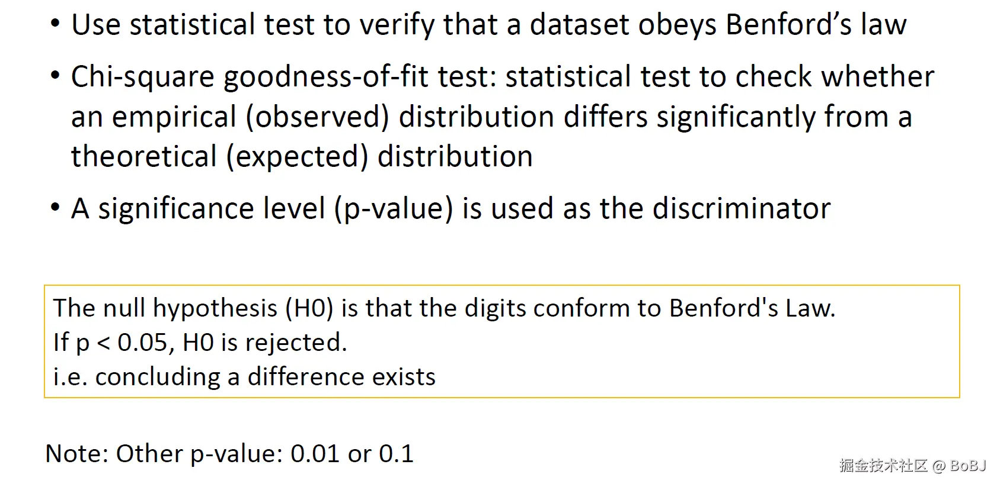

## Question 1

### Question 1.1

**答案**

The R-square values for Model 2 and Model 3 are very close and significantly higher than Model 1. This indicates that Model 2 and Model 3 can better explain the variability in the data compared to Model 1.

The Adjusted R-square value is highest for Model 2 at 0.7338. This suggests that Model 2 provides the best fit to the data even after accounting for the number of predictor variables.

In summary, while Model 3 also has a high R-square, Model 2 has the highest Adjusted R-square, indicating it provides the most robust model fit considering the complexity of the model. Therefore, I would choose Model 2 as the final fraud prediction model based on the superior R-square and Adjusted R-square values.

R-squared 是一种统计量，用于衡量回归模型中自变量对因变量变异的解释程度。其中：

    $y_i$ 是第i个实际观测值。 
    $hat{y}_i$ 是第i个模型预测值。
    $bar{y}_i$ 是所有实际观测值的均值。

R-squared 的值介于 0 和 1 之间：0 表示模型没有解释任何变异; 1 表示模型完美地解释了所有的变异。

Adjusted R-squared 是对 R-squared 的改进版本，旨在解决 R-squared 的一些局限性。Adjusted R-squared 可以减少因添加不相关的自变量而导致的 R-squared 值的虚假增长。它会惩罚那些不改善模型的变量的添加。

在构建多元线性回归模型时，建议使用Adjusted R-squared 来评估模型的优度。如果只有一个自变量，R-squared 和Adjusted R-squared 的值是相同的。（考虑了自变量数量）

计算:N 是样本总大小（行数）；p 是自变量的数量（列数）。意味着Adjusted R-squared只与样本本身（即观测值的数量）和自变量的数量（预测变量的数量）有关。

### Question 1.2

Logistic Regression的最终形式：
$p = \frac{1}{1 + e^{-(\beta_0 + \beta_1 X_1 + \beta_2 X_2 + \dots + \beta_n X_n)}}$

这里选择Model 2, Coefficient of `{X1:0.703, X2:1.936, X3:4.766, X4:0.029, X5:4.263, C: -5.768}`可以写出Model 2表达式:

**答案:**

$$
p = \frac{1}{1 + e^{-(-5.768 + 0.703 \times X_1 + 1.936 \times X_2 + 4.766 \times X_3 + 0.029 \times X_4 + 4.263 \times X_5)}} 
$$

 

### Question 1.3

**解析**
将新观测值的 X1 到 X5 各项财务指标代入公式。计算得到预测概率 p。与分类阈值`threshold` 0.5 进行比较。

补充，关于**p value**:

p-value代表在原假设为真的情况下,观测到的检验统计量会出现的概率。p-value 越小,表示数据与理论分布差异越大,越不可能在原假设为真的情况下出现

显著性水平:

*   通常使用 0.05 作为显著性水平的阈值
*   如果 p-value < 0.05,则拒绝原假设
*   如果 p-value ≥ 0.05,则无法拒绝原假设

*在本题表格中，p-value 用于检验各个自变量系数在模型中的显著性水平。*

### Question 1.4

**What is Money Laundering? Please use an example to illustrate how it works.**

1.  置放阶段(Placement Stage)
    *   将大量现金存入国内或国外银行账户,以避免引起注意。
    *   可能会采用"蚂蚁搬家"的方式,将大额资金拆分成较小的金额存入,规避报告要求。
    *   也可能利用保险产品、投资交易等方式进行置放。

2.  掩藏阶段(Layering Stage)
    *   通过在不同金融机构之间进行大量复杂的转账交易,以掩盖资金的来源。
    *   可能会利用海外银行、离岸公司、中间人等,在多个层面隐藏资金轨迹。

3.  整合阶段(Integration Stage)
    *   将洗净的资金重新融入合法经济活动,使之看似来自正常交易。
    *   可能会通过房地产交易、自有离岸公司贷款、赌博收益、工资等方式进行整合。

**答案**

\*\*Money laundering is the process of converting illegally obtained funds into seemingly legitimate assets. \*\*It typically involves three stages:

**Placement Stage**

*   The drug dealer would deposit the \$1 million in cash into multiple bank accounts to avoid raising red flags.
*   He may use "smurfing" or "structuring" techniques, splitting the large amount into smaller deposits below reporting limits to circumvent regulations.
*   He could also utilize insurance products or investment transactions to convert the cash into other asset forms.

**Layering Stage**

*   After the placement stage, he would begin conducting complex fund transfer transactions across different financial institutions.
*   He may leverage offshore companies and bank accounts in tax havens as secretive channels to layer the fund flows.
*   The multiple transfers and complex transactions aim to obscure the original source and destination of the funds.

**Integration Stage**

*   Finally, he would reinvest the "cleaned" funds into legitimate economic activities to make them appear as proceeds from normal business transactions.
*   He may purchase a real estate property, or provide himself a loan from his own offshore company and then transfer the loan amount back onshore.
*   He could also integrate the funds into gambling winnings or legitimate wage income to make them seem like lawful earnings.

Through these three stages, the drug dealer successfully transforms the \$1 million in illicit funds into seemingly legitimate assets, evading law enforcement scrutiny. This is a typical money laundering process.

### Question 1.5

**Please name 4 types of entities covered by the Anti-money Laundering Ordinance in
Hong Kong.**

香港的《打击洗钱及恐怖分子资金筹集(金融机构)条例》规定,以下4种类型的实体需要遵守相关的反洗钱法规:

*   Banks
*   Insurance companies
*   Securities firms
*   Money service operators
  
**Specified transactions include real estate transactions; management of client money,
securities or other assets; management of bank, savings or securities accounts; company
formation and management; and buying and selling of business entities, etc.**

 

## Question 2

## Question 3

### Question 3.1

**Technique 1: SMOTE (Synthetic Minority Over-Sampling Technique)**

*   Steps:
    *   Select a minority class observation.
    *   Calculate its 5 nearest neighbors.
    *   Randomly select 2 of the nearest neighbors.
    *   Randomly create 2 new synthetic observations by interpolating between the selected neighbors.

*   Advantages:
    *   Balances the dataset by generating synthetic samples for the minority class.
    *   Reduces overfitting compared to simple oversampling (e.g., duplicating minority class samples).
    *   Improves model performance on imbalanced datasets, especially for minority class recall.

*   Disadvantages:
    *   Sensitive to outliers: If minority class samples are outliers and close to the majority class, SMOTE may create synthetic samples that "bridge" the minority and majority classes, leading to classification errors.
    *   Does not consider the density distribution of the dataset, which can lead to less effective synthetic sample creation in sparse regions.

**Technique 2: ADASYN (Adaptive Synthetic Sampling)**

根据表格中的 AUC 结果,我建议选择使用\*\*平衡数据集(balanced data set)\*\*来构建欺诈检测模型,主要有以下几个原因:

*   AUC 值更高: 对于所有4种模型,在平衡数据集上的 AUC 值都明显高于不平衡数据集。这表明在平衡数据集上,模型能更好地区分正负样本,预测性能更优。
*   更可靠的模型性能评估: 不平衡数据集会导致模型过度关注多数类别,而忽视少数类别。使用平衡数据集可以更公平地评估模型在各类别上的性能。
*   更稳健的模型训练: 平衡数据集可以确保模型在训练过程中能够充分学习到少数类别的特征,避免过拟合多数类别。这有利于提高模型在实际应用中的泛化能力。

综上所述,选择平衡数据集构建欺诈检测模型能够获得更好的 AUC 性能。

### Question 3.2

根据下面公式计算：

    Recall = TP/(TP+FN) = TPR
    Precision = TP/(TP+FP)
    F1= 2*Recall*Precision/(Recall+Precision)
    True Positive Rate TPR = TP/(TP+FN)
    False Positive Rate FPR = FP/(FP+TN)
    AUC = Area Under ROC Curve

Random Forest (RF)模型在Accuracy、Recall和Precision指标上都表现最佳。

### Question 3.3

如果业务目标是**尽可能检测到欺诈行为**，那么推荐使用**RF（随机森林）+语言变量**模型。

理由：

*   召回率（Recall）：
    **召回率代表模型检测到所有实际欺诈样本的比例，是衡量模型发现欺诈能力的重要指标。**
    在所有模型中，RF 的召回率最高，为 99.136%，这表明它在检测欺诈行为方面最为全面，漏检率最低。
    业务目标优先级：

假设业务目标是尽可能多地检测欺诈行为，召回率比其他指标（如精度或 AUC）更重要，因为漏检欺诈行为可能带来更大的损失。
其他指标的权衡：

尽管 RF 的精度（Precision）和 AUC 略低于 LR 和 DT，但差距很小（精度为 99.171%，AUC 为 0.791）。在召回率优先的情况下，这些指标的轻微下降是可以接受的。

因此，基于召回率的优异表现以及业务目标的优先级，推荐选择 RF + 语言变量 模型作为最终的欺诈检测模型。

如果既需要尽可能检测到欺诈行为，同时需要**考虑误报（False Alarms）带来的业务成本**，那么推荐使用 DT（决策树）+语言变量 模型。

理由：

*   精度（Precision）：
    **精度衡量的是检测出的欺诈案例中有多少是真正的欺诈，直接与误报率相关。精度越高，误报率越低。**

在所有模型中，DT 的精度最高，为 99.542%，这表明它在减少误报方面表现最佳，有助于降低因误报带来的业务成本。
召回率（Recall）：

DT 的召回率为 98.995%，虽然略低于 RF 的 99.136%（仅差 0.141%），但仍然非常接近，说明其在检测欺诈行为方面的能力也非常强。

综合权衡：

*   DT 在精度和召回率之间达到了较好的平衡：
*   精度最高，显著减少误报，降低业务成本。
*   召回率接近最高值，依然能够有效检测大部分欺诈行为。

AUC（曲线下面积）：

*   DT 的 AUC 为 0.781，虽然不是最高，但与其他模型的差距很小，且在业务目标中影响较次要。

结论：
在需要兼顾减少误报成本和尽可能检测欺诈行为的情况下，**DT + 语言变量** 是最佳选择，因为它在精度和召回率之间达到了理想的平衡。

#### 补充笔记 ROC AUC 与 PR AUC 的区别

1.  曲线绘制的内容
    **ROC AUC (Receiver Operating Characteristic - Area Under Curve)**

*   横轴：False Positive Rate (FPR)
*   纵轴：True Positive Rate (TPR)
*   描述模型在不同阈值下，正确分类正样本的能力与错误分类负样本的可能性的关系。

**PR AUC (Precision-Recall - Area Under Curve)**

*   横轴：Recall (召回率)
*   纵轴：Precision (精确率)
*   描述模型在不同阈值下，正确分类正样本的能力与预测结果的准确性的关系。

