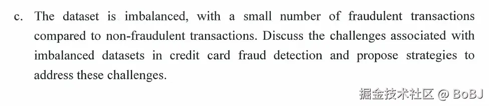

*HKU FITE7410 Financial Fraud Analytics December 9, 2023*

## Question 1

### Question 1.1

    - Customer due diligence (Recommendation 10)
    - Politically exposed persons (Recommendation 12)
    - Higher-risk countries (Recommendation 19)
    - Record keeping (Recommendation 11)
    - Reporting of suspicious transactions (Recommendation 20)
    - Tipping-off and confidentiality (Recommendation 21)

### Question 1.2

    - Country Risk
    - Customer Risk
    - Product / Service Risk
    - Delivery / Distribution Channel Risk

 

### Question 1.3

在数学中，本福特定律（英语：Benford's law）描述了真实数字数据集中首位数字的频率分布。一堆从实际生活得出的数据中，以1为首位数字的数的出现概率约为总数的三成，接近直觉得出之期望1/9的3倍。推广来说，越大的数，以它为首几位的数出现的概率就越低。它可用于检查各种数据是否有造假。但要注意使用条件：`1.数据之间的差距应该足够大。2.不能有人为操控。`

*The frequency of occurrence of the leading digits in “naturally occurring” numerical distributions is predictable and nonuniform, but closer to a power-law distribution*

**本福特定律内容**

首位数字 D 在自然数据中出现的概率遵循以下公式：Pr(D₁=d) = log₁₀(1 + 1/d)

*   d 是首位数字 (1-9)
*   Pr(D₁=d) 表示数字 d 作为首位数字出现的概率

**数据集的特征遵循本福特定律**
一系列数值记录遵循本福特定律，当它们

*   表示事件的量级，例如城市人口、河流水流量
*   没有预先设定的最小值或最大值
*   不由用作标识符的数字组成，例如身份证、银行账户、电话号码
*   平均值小于中位数，且数据不集中在平均值附近

**本福特定律如何帮助欺诈检测？** 

如果一组数据是自然形成的，它们的首位数字分布应该符合本福特定律；同样地，基于这些自然数据建立的预测模型，其预测值也应该符合本福特定律

*   通过将数据集（例如财务记录、纳税申报单）中首位数字的分布与本福特定律进行比较，如果首位数字不遵循该分布，则表明某些数据集存在欺诈行为。
*   原理：当有人试图操纵数字时，不会追踪虚假首位数字的频率，从而产生非自然的分布。可能会系统性地调整首位数字，使其低于特定阈值。
    *   例如，如果一家公司的采购限额为 100,000 美元，欺诈者可能会在许多数字中以 9 开头，例如 99,000 美元。
*   注意事项：这是一种初步筛查工具，发现异常后需要进一步调查；并非所有不符合本福特定律的数据都是欺诈，需要结合具体情况分析；应该与其他审计方法配合使用，而不是单独依赖

答案:

    Key Steps in Applying Benford's Law for Fraud Detection:

    1. Data Collection and Preparation
    - Gather financial statement data (e.g., account balances, transaction amounts)
    - Extract the leading digits from all numerical values
    - Organize the data to analyze frequency distribution

    1. Calculate Expected Distribution

    2. Compare Actual vs Expected Distribution

    3. Identify Red Flags & Focused Investigation
    - Unusual spikes in certain digits
    - T- oo many numbers starting with 9 (like $99,000) near threshold values
    - Unnaturally even distribution across digits
    - Missing or underrepresented digits

*   计算预期频率
    *   Pr(D₁=d) = log₁₀(1 + 1/d)
    *   例：\$E2=P(D1=2)=log10(1+1/2)
*   计算卡方值 (Chi-square value)：使用公式：X² = (O - E)²/E
    *   O 是观察值（Observed frequency）
    *   E 是预期值（Expected frequency）
    *   对每个数字都要计算，然后加总

| First leading digit | Observed frequency (%) (O) | Expected frequency (%) (E) | Chi-square value X² |
| ------------------- | -------------------------- | -------------------------- | ------------------- |
| 1                   | 30.83                      | 30.1                       | 0.018               |
| 2                   | 13.79                      | 17.6                       | 0.825               |
| 3                   | 9.09                       | 12.5                       | 0.93                |
| 4                   | 17.97                      | 9.7                        | 7.051               |
| 5                   | 9.90                       | 7.9                        | 0.506               |
| 6                   | 4.58                       | 6.7                        | 0.671               |
| 7                   | 4.49                       | 5.8                        | 0.296               |
| 8                   | 4.15                       | 5.1                        | 0.177               |
| 9                   | 5.20                       | 4.6                        | 0.078               |

 

## Question 2

欺诈调查是一项事实查找活动，旨在识别和收集相关信息，以确定所提出的问题是否有实质内容。调查步骤通常包括：

*   访谈管理层和相关员工
*   审查可疑交易
*   检查会计记录和主要合同
*   量化损失
*   收集证据以备审判

**Action Plan for Investigation**

1.  Preliminary Assessment

*   Objective: Understand the nature of the allegations.
*   Actions:
    *   Review the whistleblower complaint in detail.
    *   Identify key individuals and departments involved in the operations in Beijing.
    *   Assess the potential impact of the allegations on the company.

2.  Data Collection

*   Objective: Gather relevant evidence and documentation.
*   Actions:
    *   Collect financial records, including profit and loss statements, balance sheets, and transaction data related to Beijing operations.
    *   Retrieve emails, internal communications, and reports that may provide context or evidence regarding the allegations.
    *   Ensure the preservation of all relevant documents to prevent tampering.

3.  Interviews

*   Objective: Obtain insights from key personnel.
*   Actions:
    *   Conduct interviews with management, finance personnel, and employees in the Beijing office.
    *   Use open-ended questions to encourage detailed responses about operations, financial practices, and any observed irregularities.
    *   Ensure confidentiality to protect whistleblowers and encourage honest communication.

4.  Data Analysis

*   Objective: Identify anomalies and patterns indicative of fraud.
*   Actions:
    *   Utilize data analytics tools (e.g., Excel, Tableau) to analyze financial data for unusual trends, such as:
    *   Significant discrepancies in revenue and expenses.
    *   Unusual patterns in transactions or customer interactions.
    *   Implement forensic accounting techniques to trace transactions and identify any fictitious sales or expenses.

5.  Fraud Risk Assessment

*   Objective: Evaluate the internal control environment and fraud risks.
*   Actions:
    *   Conduct a fraud risk assessment to identify weaknesses in internal controls that may have allowed fraud to occur.
    *   Review the company’s policies on ethical conduct and compliance, and assess their effectiveness.
    *   Identify any "red flags" that may indicate fraudulent activities, such as unrealistic earnings targets or significant changes in supplier relationships.

6.  Reporting and Recommendations

*   Objective: Document findings and propose actions.
*   Actions:
    *   Prepare a detailed report summarizing the investigation's findings, including evidence of any irregularities or fraudulent activities.
    *   Provide recommendations for corrective actions, such as improving internal controls, enhancing fraud detection measures, and implementing training programs on ethical practices.
    *   Present findings to the management and the board of directors.

**Technology/IT Tools for Investigation**

1.  Data Analytics Tools:

*   Excel: For basic data analysis and visualization.
*   Tableau/Power BI: For advanced data visualization and trend analysis, helping to identify anomalies in financial data.

2.  Forensic Accounting Software:

*   ACL/IDEA: These tools assist in auditing data and detecting irregular patterns, enabling a more thorough examination of financial records.

3.  E-Discovery Tools:

*   Relativity: Useful for managing and analyzing large volumes of electronic communications and documents, facilitating the identification of relevant evidence.

4.  Computer Forensics:
    Tools for imaging and analyzing computers and servers to recover deleted files and investigate digital footprints related to fraudulent activities.

5.  Collaboration Tools:
    Microsoft Teams/Slack: For coordinating with team members and sharing findings securely during the investigation.

 

## Question 3

### Question 3.1

*   总数据：10,000笔交易（其中100笔为欺诈交易）
*   训练集(70%)：7,000笔交易（其中70笔为欺诈交易）
*   测试集(30%)：3,000笔交易（其中30笔为欺诈交易）

在训练集上：

    True Positives (TP) = 60（正确识别的欺诈交易）
    False Positives (FP) = 150（错误识别为欺诈的正常交易）
    False Negatives (FN) = 70 - 60 = 10（未识别出的欺诈交易）
    True Negatives (TN) = 6,930 - 150 = 6,780（正确识别的正常交易）

测试集上：

    True Positives (TP) = 15（正确识别的欺诈交易）
    False Positives (FP) = 30（错误识别为欺诈的正常交易）
    False Negatives (FN) = 30 - 15 = 15（未识别出的欺诈交易）
    True Negatives (TN) = 2,970 - 30 = 2,940（正确识别的正常交易）

### Question 3.2

首先回顾三个指标的计算公式：

*   Precision(精确率) = TP/(TP+FP)
*   Recall(召回率) = TP/(TP+FN)
*   F1-score = 2 × (Precision × Recall)/(Precision + Recall)

训练集上：

    精确率计算：Precision = 60/(60+150) = 60/210 = 0.286 = 28.6%
    召回率计算：Recall = 60/(60+10) = 60/70 = 0.857 = 85.7%
    F1分数计算：F1 = 2 × (0.286 × 0.857)/(0.286 + 0.857) = 0.429 = 42.9%

测试集上：

    精确率计算：Precision = 15/(15+30) = 15/45 = 0.333 = 33.3%
    召回率计算：Recall = 15/(15+15) = 15/30 = 0.5 = 50%
    F1分数计算：F1 = 2 × (0.333 × 0.5)/(0.333 + 0.5) = 0.4 = 40%

 

### Question 3.3

Challenges

    Model Bias:
    - Tendency to favor majority class (non-fraudulent transactions)
    - Poor performance in detecting minority class (fraudulent transactions)
    - Risk of classifying all transactions as non-fraudulent

    Evaluation Issues:
    - Traditional accuracy metrics are misleading
    - Difficulty in assessing true model performance
    - Need for specialized evaluation methods

Solutions

    Data Level:
    - Apply oversampling techniques (SMOTE)
    - Use undersampling for majority class
    - Implement hybrid sampling methods

    Algorithm Level:
    - Adjust class weights
    - Use cost-sensitive learning
    - Implement ensemble methods (Random Forest, XGBoost)

    Evaluation Strategies:
    - Use PR-AUC instead of ROC-AUC
    - Focus on precision and recall metrics
    - Implement stratified cross-validation

    Feature Engineering:
    - Create relevant transaction patterns
    - Develop time-based features
    - Extract behavioral indicators

 

### Question 3.4

这道题是在询问如何将企业的业务成本目标融入到模型训练和决策过程中。主要考虑两种错误分类带来的不同业务成本：

*   假阳性(FP)：正常交易被误判为欺诈，可能导致客户不满和业务损失
*   假阴性(FN)：欺诈交易未被发现，直接导致金钱损失

<!---->

    Cost Analysis:
    - False Negatives: Direct financial losses from undetected fraud
    - False Positives: Customer dissatisfaction, operational costs, lost transactions
    Business reputation damage from both types of errors

设置成本矩阵，根据交易金额调整权重

    Cost-Sensitive Learning Approaches:
    - Implement weighted loss functions
    - Assign higher costs to fraudulent transaction misclassification
    - Adjust decision thresholds based on cost-benefit analysis

动态阈值调整策略

    Model Optimization Strategies:
    - Custom evaluation metrics incorporating business costs
    - Cost-sensitive model selection
    - Dynamic threshold adjustment based on:
        - Transaction amount
        - Customer segment
        - Time of transaction

监控指标设置 & 定期评估和调整

    Practical Implementation:
    - Regular cost impact assessment
    - Balance between fraud prevention and customer experience
    - Continuous model monitoring and adjustment
    - Risk-based authentication systems
